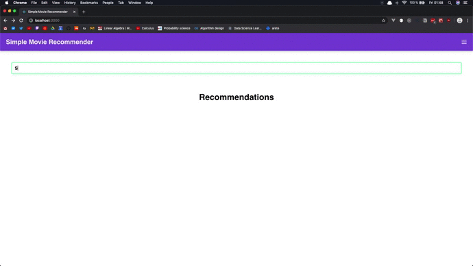

# simple-movie-recommender

## 👨‍🔧 How to setup
1. Open this (link TBA) experiment in Azure Machine Learning Studio
    * Run & Publish as web service
2. Create Azure API Management service
    * Create endpoint calling your Azure Machine Learning Studio published experiment
3. Clone & install frontend application from this repo
    * Fill in correct API & subscription keys inside `./frontend/.env` (follow `./frontend/.env_example`)
4. Run frontend application
